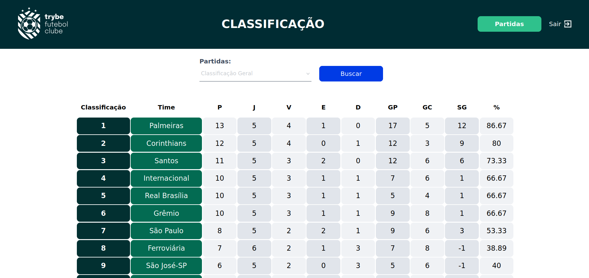
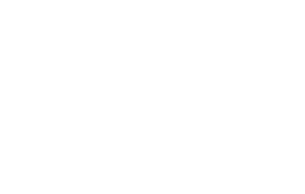

# 🚧 Documentação em progresso..





# Trybe Futebol Clube

Aplicação Fullstack de um gerenciador de partidas de futebol utilizando conceitos de programação orientada a objetos com testes de integração + TDD.

> Somente o Back-end deste projeto foi desenvolvido por mim, o front-end já estava pronto.

## ⭐ Habilidades
- Dockerizar uma aplicação
- Criar uma API utilizando o Sequelize e NodeJs e Typescript.
- Validar e criptografar tokens de autenticação com o [JWT](https://jwt.io/).
- Realizar validações de campos com o [Joi](https://joi.dev/api/).


## 💻 Como iniciar

> Antes de iniciar, é importante ressaltar que é necessário ter o Docker instalado.

1. Faça o clone do projeto
3. Instale as dependências
```shell
npm install
```
4. Inicie a aplicação subindo o container Docker
```shell
npm run compose:up
```
5. Agora basta ir ao seu navegador e acessar a URL
```shell
# Front-end:
http://localhost:3000/
# Back-end:
http://localhost:3001/
```

# 💡 Documentação da API

## Lista todos os Clubes

```http
  GET /clubs
```

| Corpo da requisição   | Tipo       | Descrição                           |
| :---------- | :--------- | :---------------------------------- |
| Vazio | `json` |  |


**Retorno em caso de sucesso**

```json
[
	{
		"id": 1,
		"clubName": "Avaí/Kindermann"
	},
	{
		"id": 2,
		"clubName": "Bahia"
	},
	{
		"id": 3,
		"clubName": "Botafogo"
	},
	...
]
```

## Feito Com:
[](https://code.visualstudio.com/)
[](https://nodejs.org/en/)
[](https://www.typescriptlang.org/)
[](https://sequelize.org/master/)
[](https://www.mysql.com/)
[](https://www.docker.com/)
[](https://www.docker.com/)
[](https://www.chaijs.com/)
[](https://pt-br.reactjs.org/)


### Contato

[](https://www.linkedin.com/in/michaelcaxias/)

<p align="center">Copyright © 2021 Michael Caxias</p>
